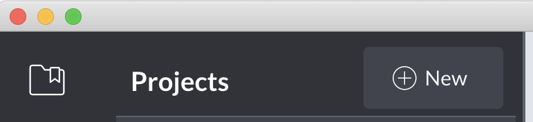
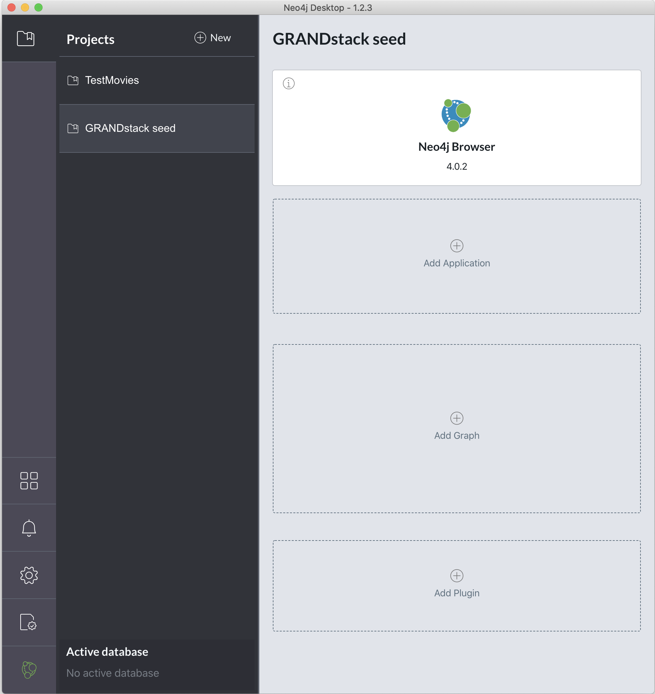
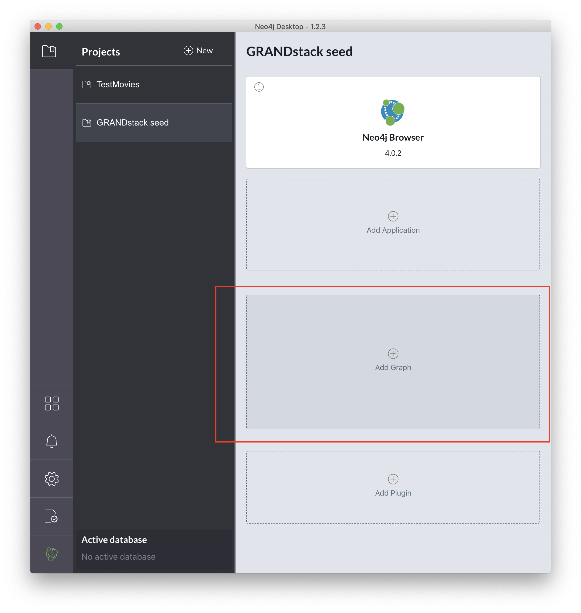
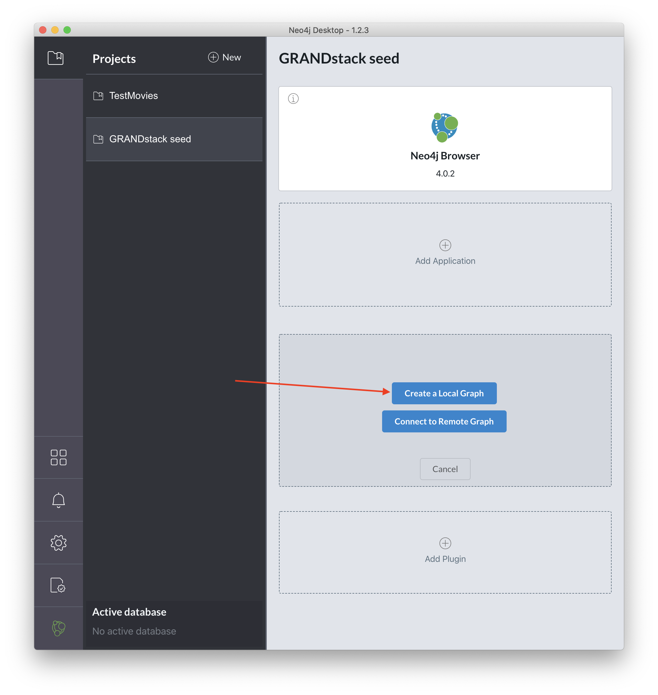
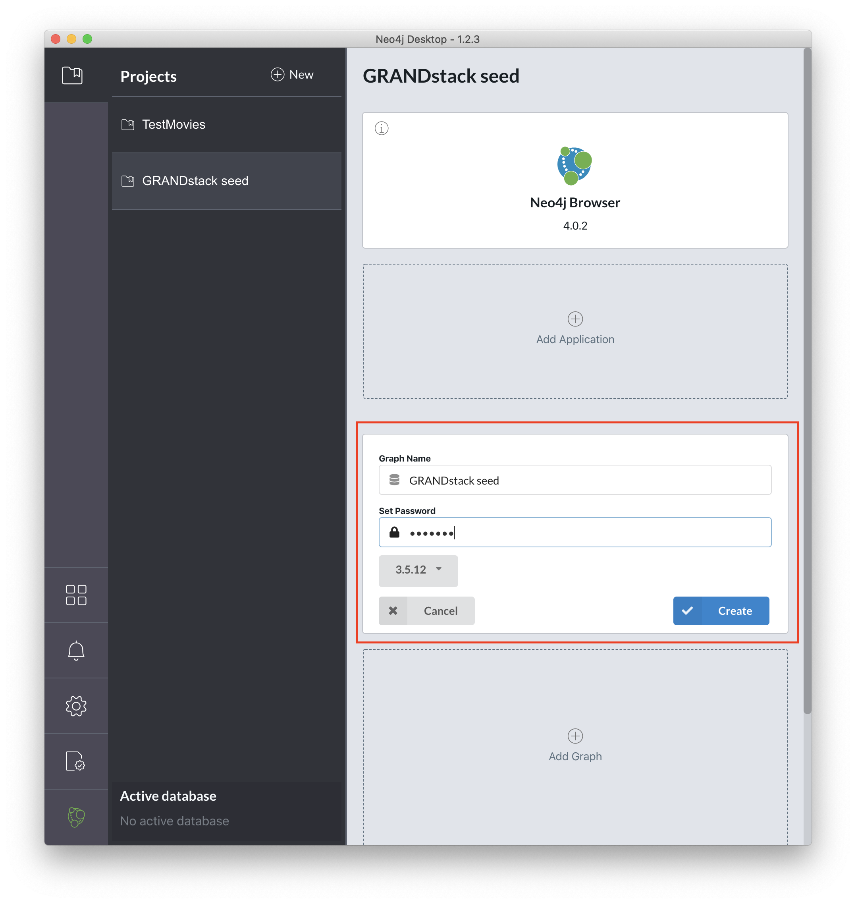
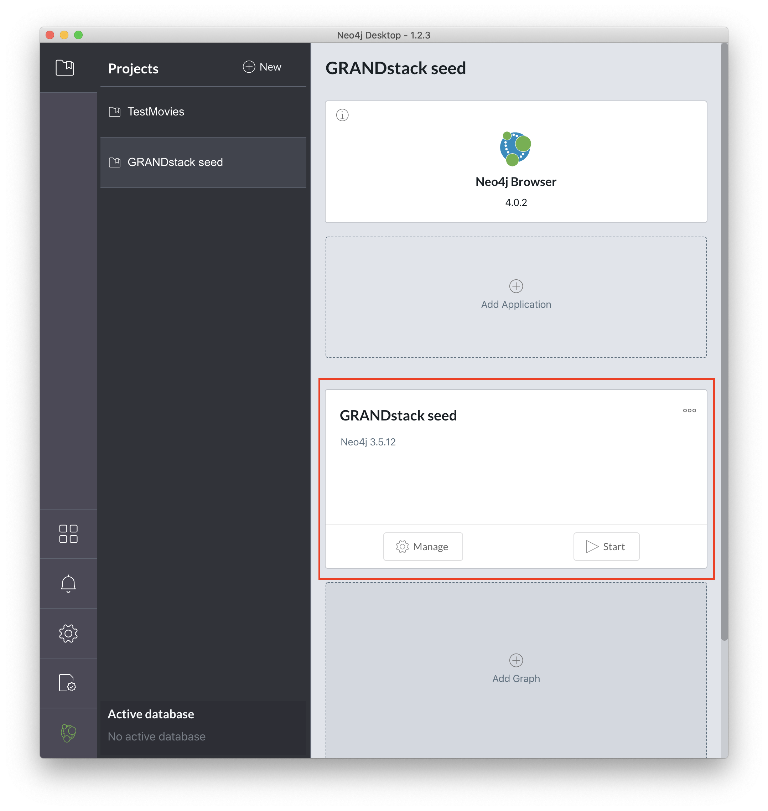
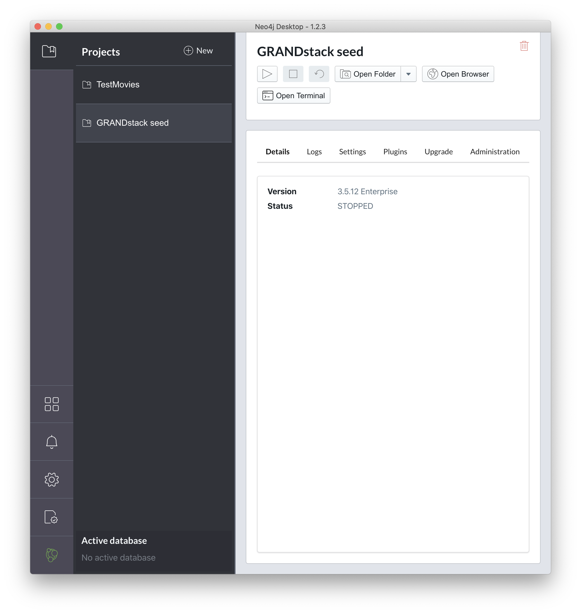
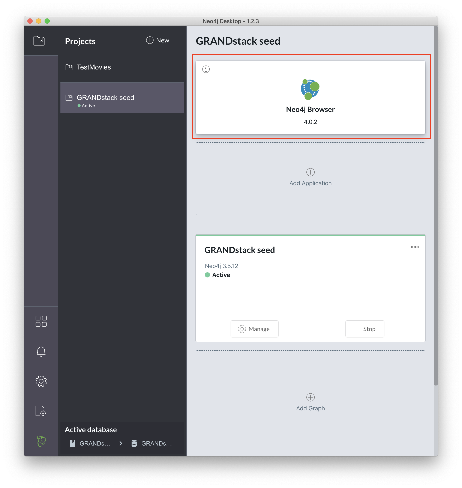
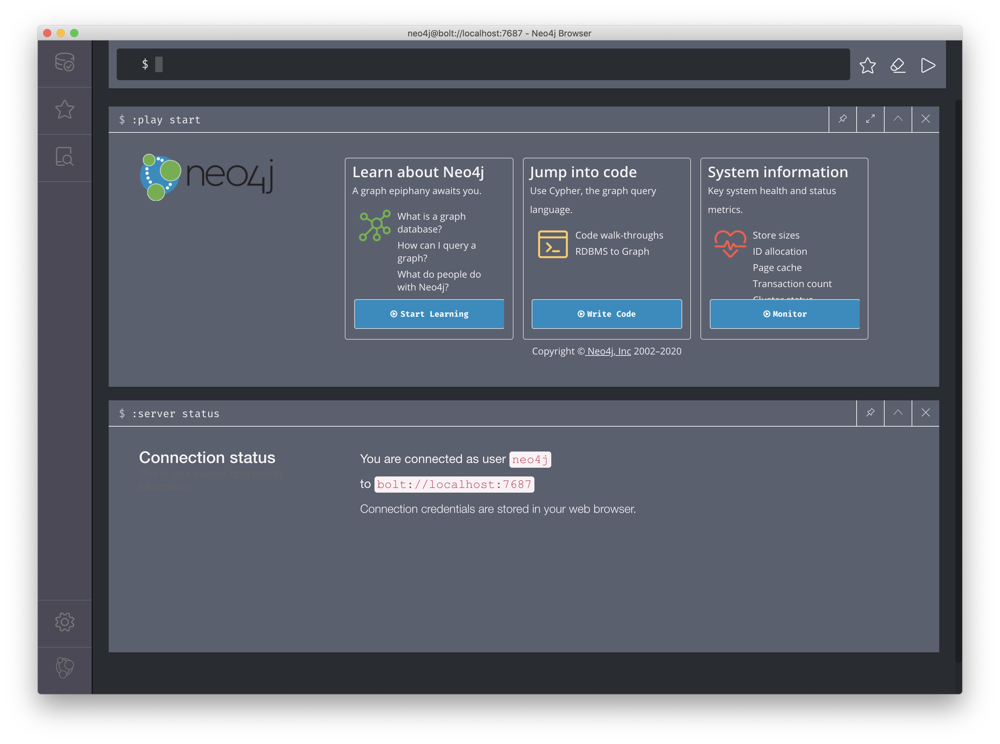

# GRANDstack seed

This GRANDStack ([GraphQL](https://graphql.org), [React](https://reactjs.org), [Apollo](https://www.apollographql.com), [Neo4j Database](https://neo4j.com)) seed project contains built-in local authentication against a Neo4j back-end database - originally inspired by existing work from [@erikrahm](https://github.com/erikrahm) in the repo [https://github.com/erikrahm/grand-stack-seed](https://github.com/erikrahm/grand-stack-seed)

To get this project up and running on your development machine, you will need to:

+ Set up and configure a locally running instance of Neo4j
+ GraphQL server configuration
  + Define environment variables for the back-end GraphQL server
  + [OPTIONAL] Additional configuration
+ Review the client application

Once you have configured Neo4j and the back-end GraphQL server, you can run the following from the root directory of this project:

```sh
# Install all of the required dependencies for this project and the related client and server applications
$ npm run install-all

# Start the back-end GraphQL server and the front-end React web application
$ npm start

# OPTIONAL: Remove all of the node_modules folders
$ npm run clean
```

## Set up and configure a locally running instance of Neo4j

The easiest way to work with this project is to download and install the free [Neo4j Desktop](https://neo4j.com/product/#desktop) for your development environment.

Once you have installed the free [Neo4j Desktop](https://neo4j.com/product/#desktop), all you will need to do is:

+ Create a new project
+ Create a new graph database
+ Start the graph database
+ Launch the Neo4j browser
+ Review the schema for the graph
+ Review constraints for the graph
  + Create constraints for the User node
  + [OPTIONAL] Remove constraints for the User node
+ [OPTIONAL] Empty the database

### Create a new project

After opening [Neo4j Desktop](https://neo4j.com/product/#desktop), you will need to create a new project:



Let's create a new project with the name `GRANDstack seed`:



### Create a new graph database

Once a project has been created, you will then need to create a new graph database:





For this demo, I will create a new graph database with the following settings:

+ `Graph Name` - `GRANDstack seed`
+ `Set Password` - `letmein`
+ Use the latest version of the Neo4j database - Version `3.5.12` in this example

...wait a minute. What about the username? By default, [Neo4j Database](https://neo4j.com) will associate this password we're defining with a `neo4j` user account.



Once we click create, we will see:



#### Take a peek: Manage the graph database

If you click on `Manage` you will see a screen similar to:



### Start the graph database

Assuming we have created our graph database, we will see something like:


We will need to explicitly start/stop our graph database if we wish to use it 🤓


### Launch the Neo4j browser

With the graph database started, we can finally fire up the Neo4j Browser - a tool we will use for querying, visualizing, and interacting with our data:

Please see [Neo4j Browser User Interface Guide](https://neo4j.com/developer/neo4j-browser/) for a great introductory video as well as a guide to working with this tool.





### Review the schema for the graph

If you would see the schema of your graph, you can run the following Cypher query:

```sh
$ CALL db.schema()
```

This will show you the simplest structure of your graph. Give it a whirl!

### Review constraints for the graph

Once you have your database running, you'll want to define constraints so that Neo4j will prevent User nodes from being added for existing email addresses or user names:

To see what constraints have been defined for your graph database already, run the following Cypher query:

```sh
$ CALL db.constraints()
```

If no constraints have been defined, you'll see a result of "(no changes, no records)"

#### Create constraints for the User node

For this specific example, we allow users the ability to choose a username for their account as well as supply an email address. We need to prevent users from creating more than one account with the same email address. We also need to prevent users from registering for a username that has already been taken.

To ensure that we do not have more than one User node with the same email address:

```sh
$ CREATE CONSTRAINT ON ( user:User ) ASSERT user.email IS UNIQUE
```

To ensure that we do not have more than one User node with the same username:
```sh
$ CREATE CONSTRAINT ON ( user:User ) ASSERT user.username IS UNIQUE
```

#### [OPTIONAL] Remove constraints for the User node

If you would like to remove these constraints from your database, simply replace `CREATE` in the above Cypher queries with `DROP`:

```sh
$ DROP CONSTRAINT ON ( user:User ) ASSERT user.email IS UNIQUE
$ DROP CONSTRAINT ON ( user:User ) ASSERT user.username IS UNIQUE
```

### [OPTIONAL] Empty the database

If you would like to delete all nodes and relationships from your graph database - and **NOT** delete/remove any constraints you have defined - you can run the following Cypher query:

```sh
$ MATCH (n) DETACH DELETE n
```

## GraphQL server configuration

Before you can run the GraphQL server, you will need to define a few environment variables for the application.

### Define environment variables for the back-end GraphQL server

For reference, I've created a sample `server/.env.sample` file that you can copy to `server/.env` and tweak as necessary.

The following environment variables must be defined for your GraphQL server to run:

```sh
# Neo4j
NEO4J_URI=bolt://localhost:7687
NEO4J_USER=neo4j
NEO4J_PASSWORD=letmein

# JWT
JWT_SECRET=thisisabadsecrettousebutitworksforanexample
```

### [OPTIONAL] Additional configuration

1. There is a schema.graphql file that contains all of the app's type definitions and is run through a schema generator that converts Cypher queries (indicated by the `@cypher` or `@relationship` directives) into valid computed properties.
2. You can turn on automatic query and mutation generation in the `server/src/graphql/graphql-schema.js` file (which would generate queries for all of your defined types, and add/update/delete mutations for all of your types), although it is strongly recommended you write your resolvers or computed properties using the directives mentioned above as it will give you more fine-grained control over your application.
3. There is local authentication already built into the application. Please see this in action in the `server/src/graphql/resolvers.js` file.
4. You can create even more complex queries and mutations by leverage in the `neo4jgraphql` method that is exposed by `neo4j-graphql-js` package by mutating data passed into a query/mutation before it hits your neo4j database, you can see this in `server/src/graphql/resolvers.js` where passwords are being hashed and salted by `bcrypt` in the `RegisterUser` mutation before being passed along to our back-end database.

## Review the client application

For this project, we replaced the client originally supplied by the example code with a simple React web application.

### [OPTIONAL] Generate a new create-react-app with TypeScript

To generate a new app using [create-react-app](https://create-react-app.dev) and [TypeScript](https://create-react-app.dev/docs/adding-typescript/):

```sh
$ npx create-react-app app --template typescript
```
